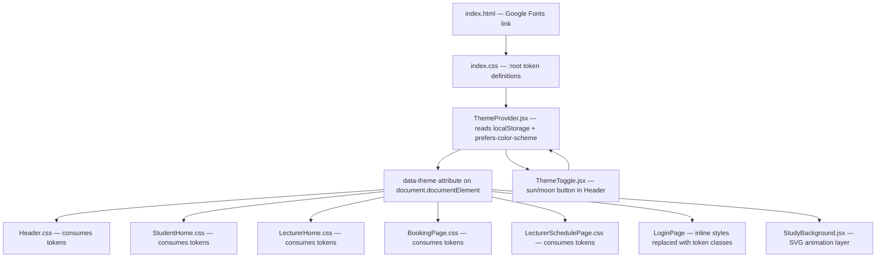
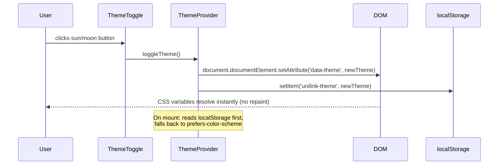
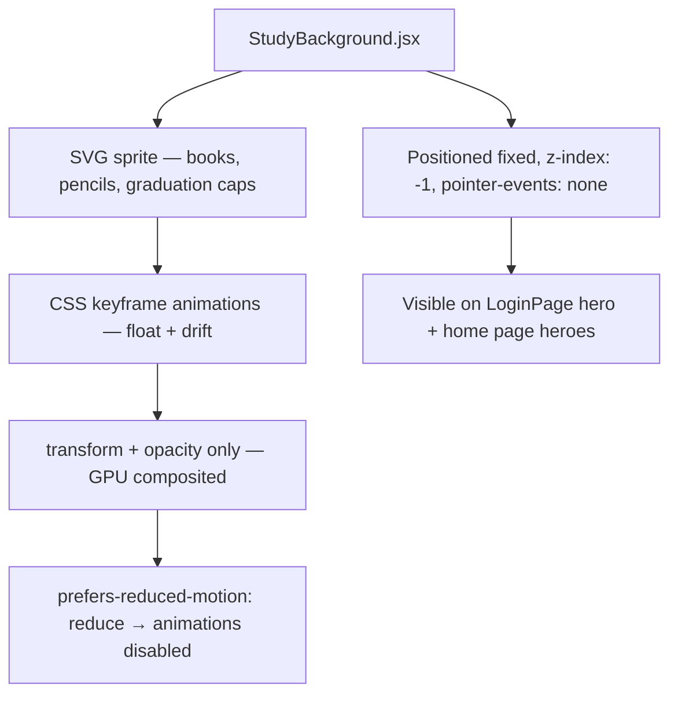

# Design Document: UniLink Luxury Theme

## Overview

A comprehensive "orange-gold luxury" UI redesign for the UniLink university appointment booking system. The theme introduces a structured CSS custom-property token system, dual light/dark palettes built around orange, gold, gray, white, and black, elegant editorial typography, study-themed background animations, and a persistent theme toggle — all layered over the existing React component tree without breaking current functionality.

The design is split into two complementary artifacts: a high-level architecture view (CSS variable structure, component inventory, theme provider approach, sequence diagrams) and a low-level specification (exact token values, animation keyframes, toggle implementation, file-by-file change plan).

---

## Architecture

### Theme System Overview



### Token Cascade

```mermaid
graph LR
    A[":root — light defaults"] -->|overridden by| B["[data-theme='dark'] — dark overrides"]
    B --> C[All CSS files via var()]
    A --> C
```

The single source of truth for all colour, spacing, and typography values lives in `index.css` under `:root`. Dark mode overrides only the colour tokens under `[data-theme="dark"]`. No JavaScript is needed to repaint — the browser resolves `var()` references instantly when the attribute changes.

### Theme Toggle Data Flow



### Study Background Layer



---

## Components and Interfaces

### ThemeProvider

**Purpose**: Manages theme state, persists to localStorage, respects `prefers-color-scheme`, and exposes context to the toggle button.

**Interface**:
```typescript
interface ThemeContextValue {
  theme: 'light' | 'dark'
  toggleTheme: () => void
}

// Context
const ThemeContext = React.createContext<ThemeContextValue>({
  theme: 'light',
  toggleTheme: () => {},
})

// Provider props
interface ThemeProviderProps {
  children: React.ReactNode
}
```

**Responsibilities**:
- On mount: read `localStorage.getItem('unilink-theme')`, fall back to `window.matchMedia('(prefers-color-scheme: dark)').matches`
- Apply `document.documentElement.setAttribute('data-theme', theme)` synchronously
- Expose `{ theme, toggleTheme }` via context
- Listen to `prefers-color-scheme` changes when no localStorage value is set

---

### ThemeToggle

**Purpose**: Sun/moon icon button rendered inside `Header`'s right cluster. ARIA-compliant.

**Interface**:
```typescript
interface ThemeToggleProps {
  // No props — reads from ThemeContext
}
```

**Responsibilities**:
- Render `<Sun>` icon in dark mode (clicking switches to light)
- Render `<Moon>` icon in light mode (clicking switches to dark)
- `aria-pressed` reflects current dark-mode state (`true` when dark)
- `aria-label` reads "Switch to light mode" / "Switch to dark mode"
- Smooth icon crossfade via CSS `transition: opacity 0.2s`

---

### StudyBackground

**Purpose**: Decorative SVG animation layer for hero sections and the login page.

**Interface**:
```typescript
interface StudyBackgroundProps {
  density?: 'low' | 'medium'  // default: 'low'
  variant?: 'hero' | 'login'  // controls z-index and opacity
}
```

**Responsibilities**:
- Render an inline SVG containing 8–12 study-themed icons (books, pencils, graduation caps, stars)
- Animate each icon with staggered `float` and `drift` keyframes using `transform` and `opacity` only
- Total SVG asset budget: ≤ 100 KB (inline, no external fetch)
- Respect `prefers-reduced-motion: reduce` — set `animation: none` via media query
- `pointer-events: none`, `position: absolute`, `z-index: 0`, `aria-hidden: true`

---

### Header (modified)

**Purpose**: Existing navigation bar, extended with ThemeToggle button.

**Changes**:
- Import and render `<ThemeToggle />` in `.header__right` cluster, between the notification bell and user chip
- Replace hardcoded colour values in `Header.css` with CSS token references
- Add `.header__theme-btn` class (reuses `.header__icon-btn` base styles)

---

## Data Models

### CSS Token Schema — Light Theme

```typescript
// Semantic token groups defined in :root {}
interface LightTokens {
  // Brand colours
  '--color-primary':        '#E8650A'   // orange — CTAs, links, active states
  '--color-primary-hover':  '#D45A08'   // slightly darker orange on hover
  '--color-primary-light':  '#FEF0E6'   // soft orange tint for selected states
  '--color-accent':         '#B5722A'   // bronze/amber — premium highlights, badges
  '--color-accent-light':   '#F5EBE0'   // warm cream — accent backgrounds
  '--color-accent-hover':   '#9A5E1F'   // deeper bronze on hover

  // Backgrounds
  '--color-bg':             '#FAFAFA'   // near-white clean page background
  '--color-bg-secondary':   '#F5F5F5'   // soft gray surface (cards, panels)
  '--color-bg-elevated':    '#FFFFFF'   // pure white — modals, dropdowns

  // Borders
  '--color-border':         '#E8E8E8'   // default border — light gray
  '--color-border-strong':  '#D0D0D0'   // stronger dividers

  // Text
  '--color-text-primary':   '#0A0A0A'   // near-black — headings, body
  '--color-text-secondary': '#4A4A4A'   // mid-gray — labels, metadata
  '--color-text-muted':     '#8A8A8A'   // light gray — placeholders, hints

  // Hero gradient (gold → orange luxury combination)
  '--color-hero-from':      '#B5722A'   // bronze start
  '--color-hero-mid':       '#D4621A'   // warm amber mid
  '--color-hero-to':        '#E8650A'   // orange end

  // Status colours (unchanged from existing)
  '--color-success':        '#15803D'
  '--color-success-bg':     '#DCFCE7'
  '--color-warning':        '#A16207'
  '--color-warning-bg':     '#FEF9C3'
  '--color-danger':         '#B91C1C'
  '--color-danger-bg':      '#FEE2E2'

  // Typography
  '--font-heading':         "'Playfair Display', 'Libre Baskerville', 'Georgia', serif"
  '--font-body':            "'DM Sans', 'Inter', 'Segoe UI', system-ui, sans-serif"
  '--font-mono':            "'JetBrains Mono', 'Fira Code', monospace"

  // Spacing scale (unchanged — existing values)
  '--radius-sm':   '8px'
  '--radius-md':   '12px'
  '--radius-lg':   '18px'
  '--radius-xl':   '24px'
  '--radius-full': '999px'

  // Shadows — warm orange-tinted
  '--shadow-sm':   '0 1px 4px rgba(232,101,10,0.08)'
  '--shadow-md':   '0 4px 20px rgba(232,101,10,0.10)'
  '--shadow-lg':   '0 8px 36px rgba(232,101,10,0.14)'
  '--shadow-hero': '0 2px 30px rgba(201,168,76,0.30)'
}
```

### CSS Token Schema — Dark Theme

```typescript
// Overrides applied under [data-theme="dark"] {}
interface DarkTokenOverrides {
  '--color-primary':        '#F97316'   // brighter orange — readable on dark bg
  '--color-primary-hover':  '#FB923C'   // lighter orange on hover
  '--color-primary-light':  '#2A1200'   // very dark orange tint surface
  '--color-accent':         '#C47830'   // bronze stays warm
  '--color-accent-light':   '#1E1008'   // very dark bronze tint
  '--color-accent-hover':   '#D98A40'   // lighter bronze on hover

  '--color-bg':             '#0A0A0A'   // near-black page background
  '--color-bg-secondary':   '#1A1A1A'   // dark gray surface
  '--color-bg-elevated':    '#2A2A2A'   // elevated panels — medium dark gray

  '--color-border':         '#333333'   // dark border
  '--color-border-strong':  '#444444'   // stronger dark dividers

  '--color-text-primary':   '#F5F5F5'   // near-white
  '--color-text-secondary': '#B0B0B0'   // light gray
  '--color-text-muted':     '#707070'   // muted gray

  // Hero gradient (black → gray luxury combination)
  '--color-hero-from':      '#0A0A0A'   // near-black start
  '--color-hero-mid':       '#1A1A1A'   // dark gray mid
  '--color-hero-to':        '#2A2A2A'   // medium dark gray end

  '--shadow-sm':   '0 1px 4px rgba(0,0,0,0.50)'
  '--shadow-md':   '0 4px 20px rgba(0,0,0,0.60)'
  '--shadow-lg':   '0 8px 36px rgba(0,0,0,0.70)'
  '--shadow-hero': '0 2px 30px rgba(0,0,0,0.70)'
}
```

### Typography Scale

```typescript
interface TypographyScale {
  // Heading font: Playfair Display (Google Fonts) — elegant editorial serif
  // Fallback: Libre Baskerville, Georgia
  // Used for: page titles, hero names, card section headings
  'h1': { fontSize: '2.5rem',  fontWeight: 700, fontFamily: 'var(--font-heading)', letterSpacing: '-0.5px' }
  'h2': { fontSize: '1.75rem', fontWeight: 700, fontFamily: 'var(--font-heading)', letterSpacing: '-0.3px' }
  'h3': { fontSize: '1.25rem', fontWeight: 600, fontFamily: 'var(--font-heading)' }

  // Body font: DM Sans (Google Fonts) — modern, clean, highly legible sans-serif
  // Fallback: Inter, Segoe UI, system-ui
  // Used for: all body text, labels, navigation, buttons
  'body-lg': { fontSize: '1rem',    fontWeight: 400, fontFamily: 'var(--font-body)', lineHeight: '1.6' }
  'body-md': { fontSize: '0.875rem',fontWeight: 400, fontFamily: 'var(--font-body)', lineHeight: '1.5' }
  'body-sm': { fontSize: '0.8rem',  fontWeight: 400, fontFamily: 'var(--font-body)' }
  'label':   { fontSize: '0.75rem', fontWeight: 600, fontFamily: 'var(--font-body)', textTransform: 'uppercase', letterSpacing: '0.5px' }
  'mono':    { fontSize: '0.875rem',fontFamily: 'var(--font-mono)' }
}
```

---

## Algorithmic Pseudocode

### Theme Initialisation Algorithm

```pascal
ALGORITHM initTheme
INPUT: none
OUTPUT: appliedTheme of type 'light' | 'dark'

BEGIN
  stored ← localStorage.getItem('unilink-theme')
  
  IF stored = 'light' OR stored = 'dark' THEN
    appliedTheme ← stored
  ELSE
    mediaQuery ← window.matchMedia('(prefers-color-scheme: dark)')
    IF mediaQuery.matches THEN
      appliedTheme ← 'dark'
    ELSE
      appliedTheme ← 'light'
    END IF
  END IF
  
  document.documentElement.setAttribute('data-theme', appliedTheme)
  
  RETURN appliedTheme
END
```

**Preconditions:**
- `localStorage` is accessible (not blocked by browser policy)
- `window.matchMedia` is available

**Postconditions:**
- `document.documentElement` has `data-theme` attribute set to either `'light'` or `'dark'`
- CSS variables resolve correctly for the chosen theme
- No visual flash — this runs synchronously before first paint (placed in `<script>` in `index.html` before React hydration)

---

### Theme Toggle Algorithm

```pascal
ALGORITHM toggleTheme
INPUT: currentTheme of type 'light' | 'dark'
OUTPUT: newTheme of type 'light' | 'dark'

BEGIN
  IF currentTheme = 'light' THEN
    newTheme ← 'dark'
  ELSE
    newTheme ← 'light'
  END IF
  
  document.documentElement.setAttribute('data-theme', newTheme)
  localStorage.setItem('unilink-theme', newTheme)
  
  RETURN newTheme
END
```

**Preconditions:**
- `currentTheme` is a valid theme value
- DOM is accessible

**Postconditions:**
- `data-theme` attribute updated synchronously
- `localStorage` persists the choice across sessions
- React state updated via `setState(newTheme)` to re-render toggle icon

---

### Animation Stagger Algorithm

```pascal
ALGORITHM assignAnimationDelays
INPUT: iconCount of type integer (8..12)
OUTPUT: delayList of type Array<float>

BEGIN
  delayList ← []
  
  FOR i FROM 0 TO iconCount - 1 DO
    ASSERT i >= 0 AND i < iconCount
    
    delay ← (i * 1.8) + (random() * 0.5)
    delayList.append(delay)
  END FOR
  
  ASSERT length(delayList) = iconCount
  
  RETURN delayList
END
```

**Loop Invariants:**
- All previously assigned delays are non-negative
- Each delay is unique (staggered by 1.8s base + random jitter)

**Postconditions:**
- Icons animate at visually distinct times, avoiding synchronised motion
- All delays are CSS-compatible float values (seconds)

---

## Key Functions with Formal Specifications

### useTheme() hook

```typescript
function useTheme(): ThemeContextValue
```

**Preconditions:**
- Must be called inside a component wrapped by `<ThemeProvider>`

**Postconditions:**
- Returns `{ theme, toggleTheme }` where `theme ∈ { 'light', 'dark' }`
- `toggleTheme()` is a stable function reference (wrapped in `useCallback`)

---

### applyThemeToDOM(theme)

```typescript
function applyThemeToDOM(theme: 'light' | 'dark'): void
```

**Preconditions:**
- `theme` is `'light'` or `'dark'`
- Called in a browser environment (not SSR)

**Postconditions:**
- `document.documentElement.dataset.theme === theme`
- All CSS `var(--color-*)` tokens resolve to the correct palette
- No layout shift or repaint triggered (attribute change only)

---

### StudyBackground render

```typescript
function StudyBackground({ density, variant }: StudyBackgroundProps): JSX.Element
```

**Preconditions:**
- `density` defaults to `'low'` if omitted
- `variant` defaults to `'hero'` if omitted

**Postconditions:**
- Returns an `aria-hidden="true"` SVG element
- Total rendered SVG markup ≤ 100 KB
- All animation keyframes use only `transform` and `opacity`
- Under `prefers-reduced-motion: reduce`, all animations are `none`

---

## Example Usage

### Wrapping the app with ThemeProvider

```typescript
// src/index.js
import React from 'react'
import ReactDOM from 'react-dom/client'
import { ThemeProvider } from './theme/ThemeProvider'
import App from './App'

ReactDOM.createRoot(document.getElementById('root')).render(
  <ThemeProvider>
    <App />
  </ThemeProvider>
)
```

### ThemeToggle inside Header

```typescript
// src/components/Header.jsx (addition)
import { ThemeToggle } from '../theme/ThemeToggle'

// Inside .header__right div, after notification bell:
<ThemeToggle />
```

### ThemeToggle component

```typescript
// src/theme/ThemeToggle.jsx
import { Sun, Moon } from 'lucide-react'
import { useTheme } from './ThemeProvider'

export function ThemeToggle() {
  const { theme, toggleTheme } = useTheme()
  const isDark = theme === 'dark'

  return (
    <button
      className="header__icon-btn header__theme-btn"
      onClick={toggleTheme}
      aria-pressed={isDark}
      aria-label={isDark ? 'Switch to light mode' : 'Switch to dark mode'}
      title={isDark ? 'Light mode' : 'Dark mode'}
    >
      {isDark ? <Sun size={19} /> : <Moon size={19} />}
    </button>
  )
}
```

### CSS token usage in a component

```css
/* Before (hardcoded blue palette) */
.sh-hero {
  background: linear-gradient(135deg, #0F2854 0%, #1C4D8D 45%, #4988C4 100%);
  color: #ffffff;
}

/* After (token-driven orange/gold luxury palette) */
.sh-hero {
  background: linear-gradient(
    135deg,
    var(--color-hero-from) 0%,
    var(--color-hero-mid)  45%,
    var(--color-hero-to)   100%
  );
  color: var(--color-text-primary);
}
```

### Light mode gradient example (gold → orange)

```css
/* Hero section — light mode: gold fading into orange */
.hero-gradient {
  background: linear-gradient(
    135deg,
    var(--color-accent)   0%,    /* gold #C9A84C */
    var(--color-hero-mid) 50%,   /* warm amber #E07A20 */
    var(--color-primary)  100%   /* orange #E8650A */
  );
}
```

### Dark mode gradient example (black → gray)

```css
/* Hero section — dark mode: near-black fading into dark gray */
/* [data-theme="dark"] resolves --color-hero-* to the dark palette automatically */
.hero-gradient {
  background: linear-gradient(
    135deg,
    var(--color-hero-from) 0%,   /* #0A0A0A near-black */
    var(--color-hero-mid)  50%,  /* #1A1A1A dark gray */
    var(--color-hero-to)   100%  /* #2A2A2A medium dark gray */
  );
}
/* Gold and orange accents remain visible as highlights on top of the dark gradient */
```

### Flash-of-wrong-theme prevention script

```html
<!-- public/index.html — inside <head>, before any stylesheet -->
<script>
  (function() {
    var stored = localStorage.getItem('unilink-theme');
    var prefersDark = window.matchMedia('(prefers-color-scheme: dark)').matches;
    var theme = stored || (prefersDark ? 'dark' : 'light');
    document.documentElement.setAttribute('data-theme', theme);
  })();
</script>
```

---

## Correctness Properties

*A property is a characteristic or behavior that should hold true across all valid executions of a system — essentially, a formal statement about what the system should do. Properties serve as the bridge between human-readable specifications and machine-verifiable correctness guarantees.*

### Property 1: Token completeness across both themes

*For any* valid theme value `t ∈ { 'light', 'dark' }`, after `applyThemeToDOM(t)` is called, every CSS `var(--color-*)` token defined in the design token schema SHALL resolve to a non-empty colour value.

**Validates: Requirements 4.1, 4.2, 5.1, 5.2**

### Property 2: Toggle parity (round-trip)

*For any* non-negative integer `n`, calling `toggleTheme()` exactly `n` times starting from `'light'` SHALL result in theme `'light'` if `n` is even and `'dark'` if `n` is odd.

**Validates: Requirements 2.1, 2.4**

### Property 3: localStorage persistence on toggle

*For any* current theme value, after `toggleTheme()` is called, `localStorage.getItem('unilink-theme')` SHALL equal the new (opposite) theme value.

**Validates: Requirements 2.3**

### Property 4: FWOT prevention — stored theme is applied before paint

*For any* valid theme value stored in `localStorage`, the FWOT_Script SHALL set `document.documentElement.getAttribute('data-theme')` to that value synchronously, before any stylesheet is parsed.

**Validates: Requirements 1.1, 1.4**

### Property 5: localStorage allowlist validation

*For any* arbitrary string value stored in `localStorage` under `'unilink-theme'`, if that value is not `'light'` or `'dark'`, THE System SHALL ignore it and fall back to `prefers-color-scheme` detection.

**Validates: Requirements 1.3, 10.5**

### Property 6: Animation keyframe constraint

*For all* CSS keyframe rules defined within `StudyBackground`, no keyframe SHALL modify `width`, `height`, `top`, `left`, `margin`, or `padding` — only `transform` and `opacity` SHALL be used.

**Validates: Requirements 7.2, 10.1**

### Property 7: ARIA pressed reflects theme state

*For any* theme value, `aria-pressed` on the ThemeToggle element SHALL equal `true` if and only if `theme === 'dark'`.

**Validates: Requirements 3.3**

### Property 8: applyThemeToDOM idempotence

*For any* valid theme value `t`, calling `applyThemeToDOM(t)` twice in succession SHALL produce the same `document.documentElement` state as calling it once.

**Validates: Requirements 2.2, 4.4**

---

## Error Handling

### localStorage Unavailable

**Condition**: Browser blocks `localStorage` (private mode, security policy)
**Response**: `try/catch` around all `localStorage` calls; fall back to `prefers-color-scheme` silently
**Recovery**: Theme still works per-session via React state; no error shown to user

### Google Fonts Load Failure

**Condition**: Network unavailable, fonts fail to load
**Response**: CSS `font-family` stacks include system fallbacks: `'Libre Baskerville', 'Georgia', serif` for headings; `'Inter', 'Segoe UI', system-ui, sans-serif` for body
**Recovery**: UI remains fully functional and legible with system fonts

### SVG Animation Performance

**Condition**: Low-end device struggles with multiple simultaneous animations
**Response**: `will-change: transform` on animated elements; `prefers-reduced-motion` disables all animations
**Recovery**: Static decorative icons remain visible without motion

---

## Testing Strategy

### Unit Testing Approach

- `ThemeProvider`: test that `initTheme` reads `localStorage` correctly, falls back to `prefers-color-scheme`, and sets `data-theme` on `document.documentElement`
- `ThemeToggle`: test that `aria-pressed` reflects theme state, `aria-label` updates correctly, and clicking calls `toggleTheme`
- Token completeness: test that all expected `--color-*` tokens are defined in both `:root` and `[data-theme="dark"]`

### Property-Based Testing Approach

**Property Test Library**: fast-check

- Property: for any sequence of `toggleTheme()` calls of length `n`, the final theme equals `'light'` if `n` is even, `'dark'` if `n` is odd (starting from `'light'`)
- Property: `applyThemeToDOM` is idempotent — calling it twice with the same argument produces the same DOM state as calling it once

### Integration Testing Approach

- Render `<ThemeProvider><Header /></ThemeProvider>` and verify ThemeToggle is present and functional
- Simulate click on ThemeToggle and assert `document.documentElement.getAttribute('data-theme')` changes
- Verify `localStorage` is updated after toggle
- Verify page renders without flash when `localStorage` has a stored theme (using jsdom)

---

## Performance Considerations

- CSS custom properties resolve at paint time — theme switching requires zero JavaScript repaints; the browser re-resolves `var()` references natively
- Google Fonts loaded with `display=swap` to prevent render-blocking
- `StudyBackground` SVG is inline (no network request); total markup budget ≤ 100 KB
- All animations use `transform` and `opacity` exclusively — these are GPU-composited and do not trigger layout or paint
- `will-change: transform` applied only to animated SVG icons (not globally, to avoid excess memory use)
- Dark mode colour tokens use the same CSS variable names — no additional stylesheet is loaded for dark mode
- Smooth gradients (gold → orange in light mode, black → gray in dark mode) are pure CSS and carry zero runtime cost

---

## Security Considerations

- `localStorage` values are validated against an allowlist `['light', 'dark']` before use — arbitrary values are ignored and fall back to the default
- The inline `<script>` in `index.html` for FWOT prevention contains no user-controlled data and no external fetches
- Google Fonts is loaded via HTTPS from `fonts.googleapis.com` — standard CDN, no credentials sent

---

## File Structure Changes

```
frontend/
├── public/
│   └── index.html                    MODIFIED — add FWOT script + Google Fonts <link>
│
└── src/
    ├── index.css                     MODIFIED — add :root token block + [data-theme="dark"] overrides
    │
    ├── theme/                        NEW DIRECTORY
    │   ├── ThemeProvider.jsx         NEW — context + localStorage + matchMedia logic
    │   ├── ThemeToggle.jsx           NEW — sun/moon button component
    │   └── StudyBackground.jsx       NEW — SVG animation layer
    │
    ├── index.js                      MODIFIED — wrap <App> with <ThemeProvider>
    │
    ├── components/
    │   ├── Header.jsx                MODIFIED — add <ThemeToggle />, replace hardcoded colours
    │   └── Header.css                MODIFIED — replace hardcoded hex values with var() tokens
    │
    └── pages/
        ├── LoginPage.jsx             MODIFIED — replace inline authInputStyle/authButtonStyle with token classes
        ├── StudentHome.css           MODIFIED — replace hardcoded palette with var() tokens
        ├── LecturerHome.css          MODIFIED — replace hardcoded palette with var() tokens
        ├── BookingPage.css           MODIFIED — replace hardcoded palette with var() tokens
        ├── LecturerSchedulePage.css  MODIFIED — replace hardcoded palette with var() tokens
        ├── NotificationsPage.css     MODIFIED — replace hardcoded palette with var() tokens
        ├── ProfilePage.jsx           MODIFIED — replace inline styles with token classes
        └── UtilityPages.jsx          MODIFIED — replace inline styles with token classes
```

---

## Dependencies

| Dependency | Source | Purpose |
|---|---|---|
| Playfair Display | Google Fonts | Elegant editorial serif heading font — luxury/high-end feel |
| DM Sans | Google Fonts | Modern, clean sans-serif body font — highly legible |
| Libre Baskerville | Google Fonts | Serif fallback for headings if Playfair Display unavailable |
| lucide-react | Already installed | Sun and Moon icons for ThemeToggle |
| React Context API | Built-in | ThemeProvider state management |
| CSS Custom Properties | Browser native | Token-based theming, zero runtime cost |
| localStorage | Browser native | Theme persistence across sessions |
| `prefers-color-scheme` | Browser native | System theme detection |
